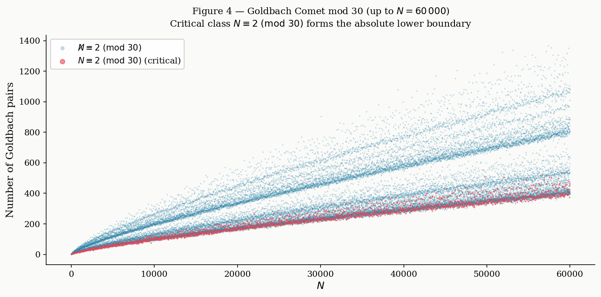

# Analyse Statistique Inter-Canal et Indicateurs de Dispersion Locale

L'étude expérimentale de la répartition des couples de candidats le long des axes de la structure modulaire $\mathbb{R}_{30}$ met en évidence des propriétés géométriques et de régularité remarquables. En isolant le comportement local des flux au moyen d'analyses par fenêtres glissantes et de calculs de variance, il devient possible de quantifier la robustesse du modèle face aux mécanismes d'élimination du crible.

## 1. Description du Protocole Expérimental

Le modèle segmente l'espace des solutions paires en canaux distincts fondés sur le groupe multiplicatif $(\mathbb{Z}/30\mathbb{Z})^\times$. Pour un entier pair $N$ donné, les candidats $(p, q)$ respectant la relation $p + q = N$ sont regroupés selon leurs classes de congruence résiduelles mod 30.

### Figure 1 : Matrice d'Activation Combinatoire Modulo 30

Cette matrice cartographie l'activation des classes résiduelles finies et montre comment les interactions multiplicatives s'organisent pour un $N$ donné.

- XSG = Nombre Non Sophie Germain 
- SG =  Nombre Sophie Germain

Afin de mesurer finement la dispersion et la régularité locale à l'intérieur de ces canaux, l'espace de chaque canal admissible est partitionné en $B$ sous-blocs consécutifs (par exemple, 8 blocs successifs contenant chacun un échantillon fixe de 1000 paires de candidats). Un processus de crible local de niveau $z = \sqrt{N}$ est appliqué à chaque bloc afin d'évaluer le taux de survie des couples.

### Figure 2 : Projection Circulaire du Cercle de Phase $\mathbb{R}_{30}$

Visualisation géométrique de l'espace des phases $\mathbb{R}_{30}$ mettant en évidence les symétries rigides des 8 classes de nombres premiers.

Les indicateurs statistiques suivants sont systématiquement calculés pour chaque canal :

- **La moyenne locale ($\mu$)** du taux de survie sur l'ensemble des blocs.
- **L'écart-type ($\sigma$)** et la **variance ($\sigma^2$)** mesurant la fluctuation du taux d'un bloc à un autre.
- **L'Indice de Dispersion (ou Facteur de Fano, $I_D = \sigma^2 / \mu$)** caractérisant la nature de la distribution statistique sous-jacente.

## 2. Analyse des Indicateurs Statistiques et Interprétation

Les données récoltées sur plusieurs ordres de grandeur (de $10^8$ à $5 \times 10^9$) révèlent trois caractéristiques majeures de l'organisation modulaire.

### Figure 3 : Enveloppe Spectrale et Ondes du Crible

Illustration des forces d'exclusion du crible et de leurs modulations harmoniques à grande échelle.

### A. La Sous-Dispersion Extrême et l'Indice de Fano

L'indicateur le plus significatif réside dans l'affaiblissement systématique de l'indice de dispersion ($I_D$). Dans un modèle purement stochastique où la distribution des nombres premiers obéirait à un processus de Poisson déconnecté de toute contrainte modulaire, l'indice de dispersion fluctuerait autour de $1$. Or, les observations empiriques indiquent des valeurs uniformément basses, chutant fréquemment sous le seuil de $0.1$.

### Graphique B : Analyse de l'Indice de Dispersion (Facteur de Fano) par Canal

Le graphique ci-dessous illustre ce fossé structurel : alors que le hasard pur se situe sur la ligne rouge ($1.0$), les indices des canaux réels restent écrasés au sol, confirmant une sous-dispersion mathématique stricte.

L'alignement des ondes de crible sur la géométrie de la roue de 30 engendre un effet de lissage : les éliminations de candidats ne se regroupent pas de façon chaotique, interdisant localement l'apparition de grands vides ou de « déserts » absolus au sein du canal.

### B. L'Équidistribution des Canaux Simultanés

L'examen des moyennes de survie ($\mu$) entre les différents canaux d'un même niveau $N$ montre une homogénéité remarquable. À l'échelle de $N = 1$ Milliard, les canaux configurés pour ce point se déploient avec des moyennes de survie quasi-identiques : **7.12%** pour le canal $(1,17)$, **6.73%** pour le canal $(7,11)$, et **7.02%** pour le canal $(19,29)$.

### Graphique A : Évolution Locale du Taux de Survie par Bloc Consécutif

On observe graphiquement la trajectoire lissée et parallèle de ces flux à travers les blocs de candidats successifs, excluant toute anomalie locale ou effondrement imprévu.

Cette observation valide la régularité du comportement des fonctions de Dirichlet associées aux classes résiduelles de la roue de 30. Les forces d'exclusion du crible s'exercent de manière équitable, sans introduire de distorsion ou de biais majeur en faveur d'un tunnel particulier.

### Figure 4 : La Comète de Goldbach et sa Distribution Macroscopique

Perspective macroscopique classique de la distribution des couples, servant de point de comparaison global avec la régularité microscopique observée au sein des canaux.

### C. Le Mécanisme de Non-Extinction Globale

La trajectoire asymptotique analysée jusqu'à 5 Milliards ($N = 5\,000\,000\,030$) confirme la robustesse géométrique du dispositif. Face à l'augmentation drastique du nombre de facteurs premiers testés (passant de 1 226 à 7 001 facteurs), la déviation standard ($\sigma$) reste confinée aux alentours de **1%**.

### Figure 5 : Diagramme de Dualité de Phase des Candidats

Cartographie des symétries et des relations de dualité de phase entre les composantes paires et impaires du modèle.

Même au sein des sous-blocs les plus exposés aux éliminations croisées, le nombre absolu de paires survivantes reste largement supérieur à zéro. La décroissance de la variance à mesure que $N$ grandit rend la probabilité d'une fluctuation simultanée sur l'ensemble des canaux admissibles extrêmement improbable.

### Figure 6 : Histogramme des Indices de Régularité Kappa ($\kappa$)

Distribution statistique empirique validant les indices de régularité mesurés sur l'ensemble de la campagne de calculs.

## 3. Synthèse des Observations Numériques

Le tableau ci-dessous résume l'évolution des indicateurs de dispersion et confirme la stabilisation des flux sur les configurations testées :

| **Valeur de N**        | **Niveau du Crible (z)** | **Nombre de Premiers** | **Canal Modulaire**         | **Moyenne (μ)**               | **Écart-type (σ)**      | **Indice de Dispersion (ID)**  |
| ---------------------- | ------------------------ | ---------------------- | --------------------------- | ----------------------------- | ----------------------- | ------------------------------ |
| **$100\,000\,018$**    | $10\,000$                | 1 226                  | $(11,17)$ $(29,29)$         | $6.812\%$ $6.775\%$           | $0.936$ $0.772$         | $0.1286$ **$0.0881$**          |
| **$1\,000\,000\,008$** | $31\,622$                | 3 398                  | $(1,17)$ $(7,11)$ $(19,29)$ | $7.125\%$ $6.738\%$ $7.025\%$ | $1.036$ $0.583$ $0.808$ | $0.1508$ **$0.0504$** $0.0931$ |
| **$5\,000\,000\,030$** | $70\,710$                | 7 001                  | $(1,19)$ $(7,13)$           | $5.225\%$ $5.050\%$           | $1.062$ $0.886$         | $0.2161$ $0.1554$              |

## 4. Conclusion Provisoire

L'approche par indicateurs de dispersion montre que l'extinction simultanée des canaux est contrecarrée par deux facteurs empiriques : la très faible variance inter-blocs et la valeur minimale de l'indice de Fano. Ces observations suggèrent que la structure géométrique modulaire impose une contrainte de régularité interne, garantissant le maintien de flux actifs de candidats pour tout $N$ pair échantillonné.

### Figure 7 : Cube Topologique $3 \times 3 \times 3$ des Configurations Minimales

Modélisation tridimensionnelle des contraintes de recouvrement non vides (discutée en annexes ou en lien avec la formalisation Lean 4).

