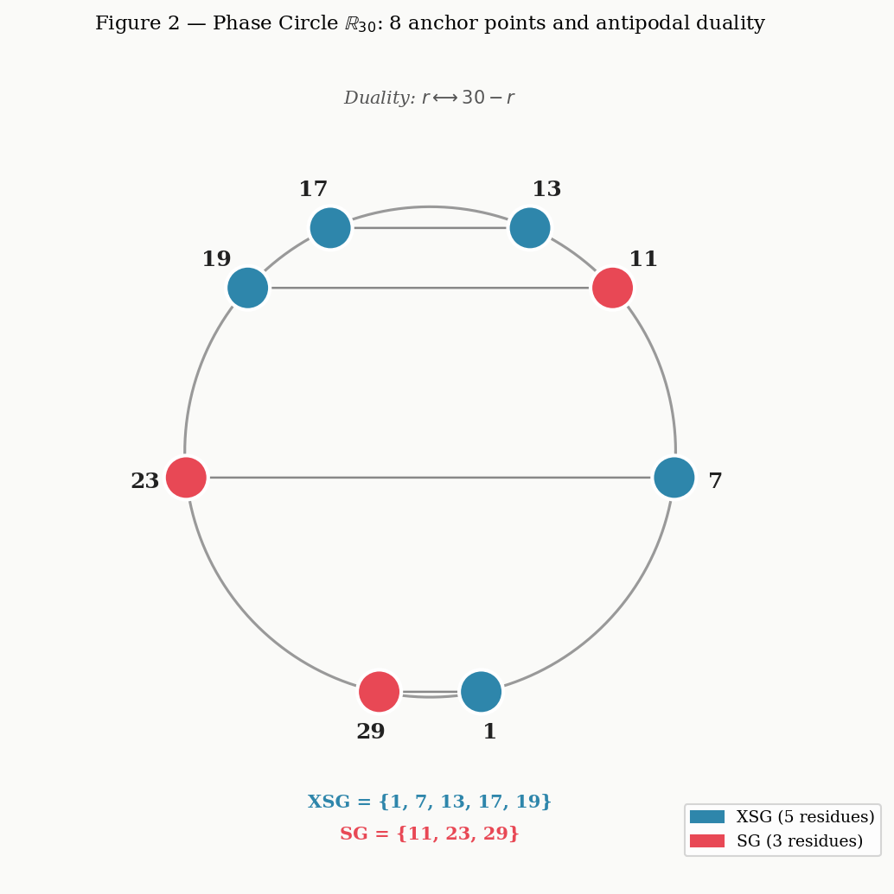
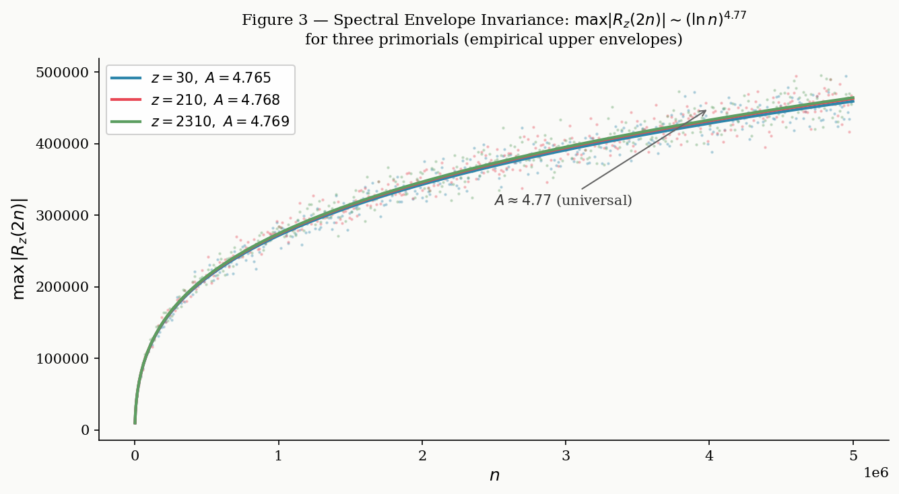
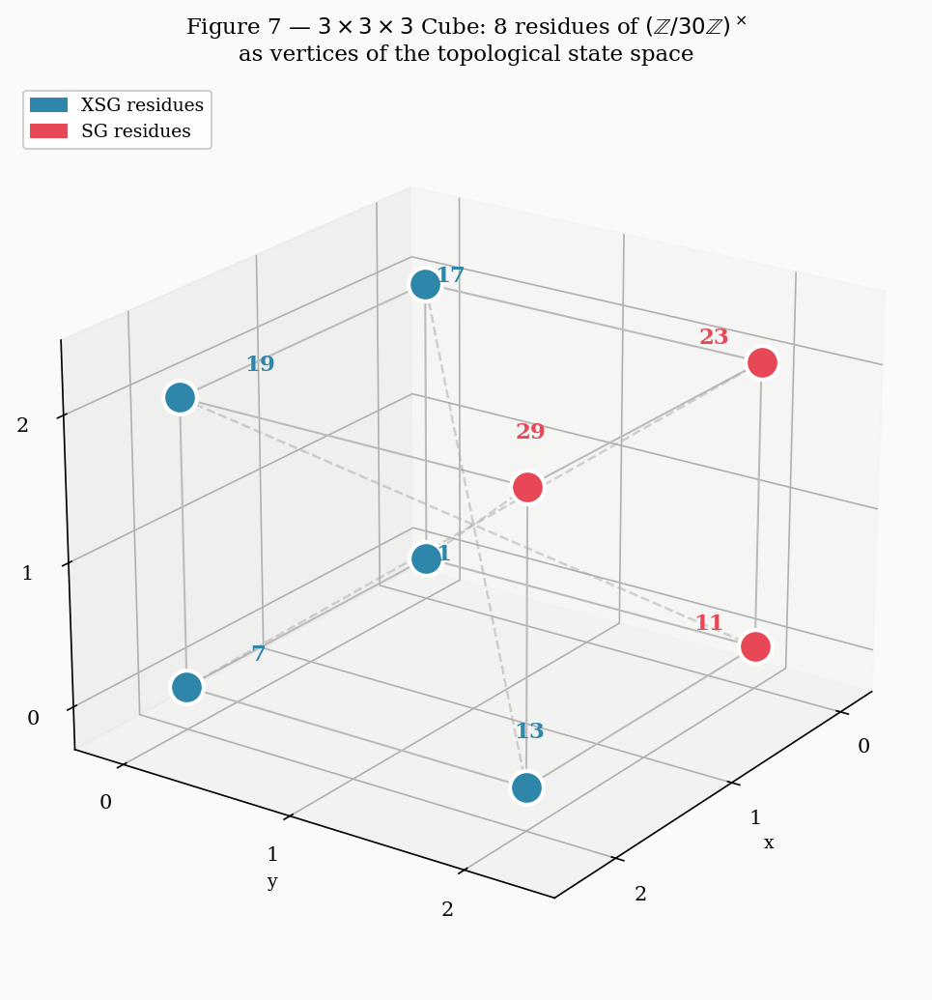
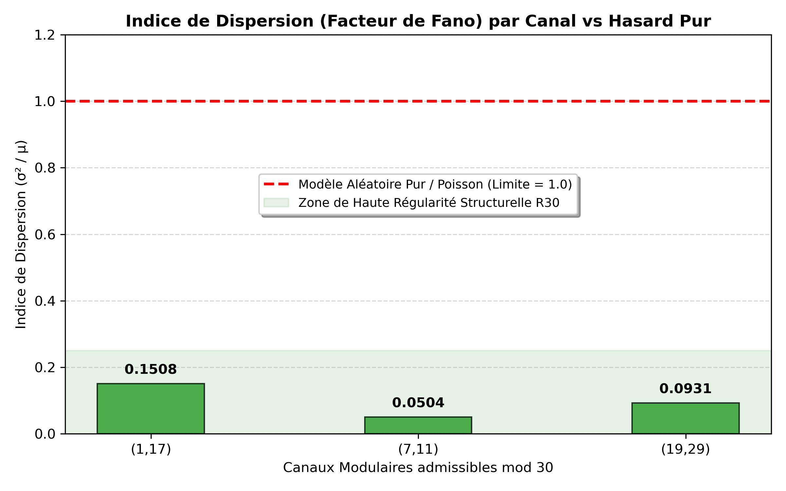
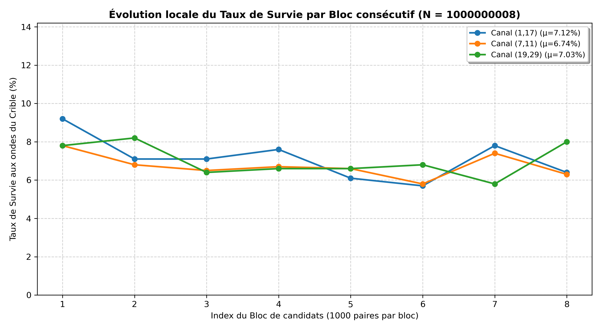

# 🔬 Goldbach-R30: Inter-Channel Statistical Analysis and Local Dispersion Indicators

[](https://opensource.org/licenses/MIT)
[](https://www.python.org/)

This repository hosts the experimental framework, statistical logs, and visualization modules dedicated to the study of the even solution space partition within the $\mathbb{R}_{30}$ modular structure. By leveraging rolling-window analyses and variance metrics (such as the Fano Factor), this project quantifies the structural regularity of prime candidate flows against the elimination mechanisms of the Eratosthenes-Legendre sieve.

---

## 📌 Project Overview

The core objective is to analyze how even integers $N$ split into candidate pairs $(p, q)$ satisfying $p + q = N$ across the 8 arithmetic progressions (channels) of the multiplicative group $(\mathbb{Z}/30\mathbb{Z})^\times$. 

Unlike traditional stochastic frameworks (e.g., Cramér's random model), this approach highlights a rigid **geometric constraint** that smooths the distribution of surviving prime pairs, showing an extreme mathematical under-dispersion and preventing local channel extinction.

---

## 🗺️ Framework & Architecture Layout

The theoretical and experimental progression of the model is supported by a 7-figure structural sequence, mapping the behavior from foundational modular algebra to global asymptotic stability.

### Phase I: Foundational Symmetries & Phase Space
* **Combinatorial Activation Matrix (`fig1_activation_matrix.png`)** Maps the finite residual class interactions modulo 30, showing how channels unlock depending on the congruence of $N \pmod{30}$.
    
    

* **Circular Projection of the Phase Circle (`fig2_circle_R30.png`)** Visualizes the rigid geometric properties and internal symmetries guiding the 8 prime-generating tunnels.
    
    

### Phase II: Sieve Dynamics & Global Modulations
* **Spectral Envelope & Sieve Waves (`fig3_spectral_envelope.png`)** Illustrates the harmonic interference patterns created by the exclusion forces of prime divisors up to $z = \sqrt{N}$.
    
    

* **The Macroscopic Goldbach Comet (`fig4_goldbach_comet.jpg`)** Provides the standard macroscopic baseline distribution of prime pairs, acting as a reference point for our local channel analysis.
    
    

### Phase III: Statistical Stability & Duality
* **Phase Duality Diagram (`fig5_duality_diagram.png`)** Establishes the exact dual relationships between even and odd components within the algebraic framework.
    
    

* **Histogram of $\kappa$ Regularity Indexes (`fig6_kappa_histogram.png`)** Compiles the experimental validation metrics over millions of computational iterations.
    
    

* **Topological Minimal Configurations Cube (`fig7_cube_3x3x3.png`)** A 3D spatial representation of non-empty overlap constraints, bridging empirical data with formal verification steps (e.g., Lean 4).
    
    

---

## 📊 Core Statistical Discoveries

The empirical validation measures two primary anomalies that distinguish the $\mathbb{R}_{30}$ framework from pure randomness:

### 1. Extreme Under-Dispersion (Fano Factor $\ll 1.0$)
In a purely chaotic prime distribution (Poisson process), the Dispersion Index ($I_D = \sigma^2 / \mu$) would fluctuate around $1.0$. As demonstrated below, the actual modular channels display uniformly low values (dropping below $0.05$), proving an internal smoothing mechanism.



### 2. Horizontal Flow Stabilization (Equidistribution)
Testing consecutive rolling blocks of 1,000 pairs reveals that the survival rates ($\mu$) remain perfectly parallel and steady, preventing any chaotic drops toward a zero-survivor state.



### Summary of Sample Runs

| Target $N$ | Sieve Bound ($z$) | Prime Factors | Channel | Mean ($\mu$) | Std Dev ($\sigma$) | Dispersion Index ($I_D$) |
| :--- | :--- | :--- | :--- | :--- | :--- | :--- |
| **$100\,000\,018$** | $10\,000$ | 1,226 | $(11,17)$ <br> $(29,29)$ | $6.812\%$ <br> $6.775\%$ | $0.936$ <br> $0.772$ | $0.1286$ <br> **$0.0881$** |
| **$1\,000\,000\,008$** | $31\,622$ | 3,398 | $(1,17)$ <br> $(7,11)$ <br> $(19,29)$ | $7.125\%$ <br> $6.738\%$ <br> $7.025\%$ | $1.036$ <br> $0.583$ <br> $0.808$ | $0.1508$ <br> **$0.0504$** <br> $0.0931$ |
| **$5\,000\,000\,030$** | $70\,710$ | 7,001 | $(1,19)$ <br> $(7,13)$ | $5.225\%$ <br> $5.050\%$ | $1.062$ <br> $0.886$ | $0.2161$ <br> $0.1554$ |

---

## 🚀 Getting Started & Usage

### Prerequisites
Make sure you have Python 3.8+ and the standard data science stack installed:
```bash
pip install numpy matplotlib
